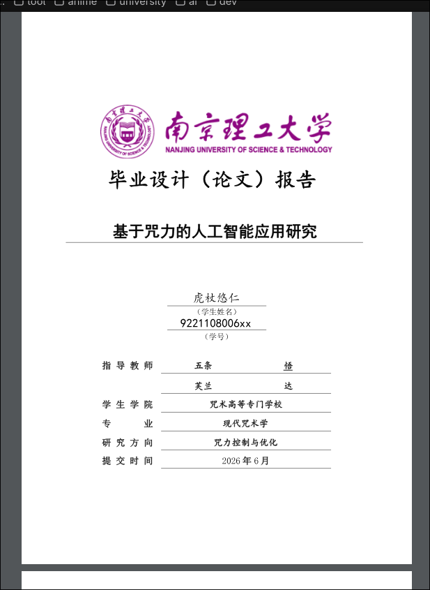

# njust-typst

南京理工大学本科毕业设计（论文）Typst 模板。

基于《南京理工大学本科毕业设计（论文）报告撰写格式》规范，通过像素级对比校验，精确还原模板样式。



## 快速开始

### 环境要求

- [Typst](https://typst.app/) >= 0.14
- 字体：SimSun、SimHei、KaiTi、Times New Roman（位于 `assets/` 目录）

### 编译

```bash
TYPST_FONT_PATHS=./njust-typst/assets typst compile main.typ
```

说明：若使用模板内置的双语参考文献修复功能，请确保 Typst 可以拉取 Universe 依赖。

### Neovim 用户

在项目根目录创建 `.nvim.lua`：

```lua
vim.env.TYPST_FONT_PATHS = vim.fn.fnamemodify("njust-typst/assets", ":p")
```

需启用 `exrc` 并信任该文件。

## 项目结构

```
.
├── main.typ                  # 论文主文件（用户编辑）
├── ref.bib                   # 参考文献数据库
├── njust-typst/
│   ├── lib.typ               # 统一导出
│   ├── common.typ            # 公共样式（字体、字号、页眉页脚、main-body wrapper）
│   ├── pages/
│   │   ├── cover/standard.typ  # 封面
│   │   ├── declare.typ         # 声明
│   │   ├── summary.typ         # 中/英文摘要
│   │   ├── contents.typ        # 目录
│   │   ├── charts.typ          # 图表目录
│   │   ├── reference.typ       # 参考文献
│   │   ├── acknowledge.typ     # 致谢
│   │   └── appendix.typ        # 附录
│   ├── assets/                 # 字体文件
│   ├── example/                # 匿名化完整示例工程
│   └── skills/                 # 开发工具
│       ├── pixel-verify.md     # 像素级校验流程
│       └── njust-template.pdf  # 官方模板 PDF
└── typst.toml
```

## 使用方法

### 1. 设置论文题目

题目只需定义一次，所有页面自动读取：

```typst
#let thesis-title = "你的论文题目"
#njust.thesis-title-state.update(thesis-title)
```

### 2. 封面

```typst
#njust.cover-standard(
  title: thesis-title,
  student-name: "姓名",
  student-number: "学号",
  supervisor-1: ("指导教师",),       // 第一行，数组可多项分区域居中
  supervisor-2: ("校外导师",),       // 第二行（可选）
  department: "学院",
  major: "专业",
  research-direction: "研究方向",
  date: "2026年6月",
)
```

双导师分区域示例：

```typst
  supervisor-1: ("校内导师 教授", "校外导师 ××"),  // 一行分两区域
  supervisor-2: (),
```

单个指导教师需加尾逗号，防止 Typst 格式化去掉括号：

```typst
  supervisor-1: ("×××",),   // ← 尾逗号
  supervisor-2: (),
```

姓名支持下划线标注（如多音字）：

```typst
  student-name: "五条" + underline(stroke: 1pt, offset: 2pt)[悟],
```

### 3. 中文封二

```typst
#njust.cover-inner-zh(
  title: thesis-title,
  student-name: "姓名",
  supervisor-1: ("导师姓名", "职称"),  // 第一导师（姓名, 职称）
  supervisor-2: ("校外导师",),         // 第二导师（可选）
  date: "2026年6月",
  heading: "学 士 学 位 论 文",         // 可选，默认 "学 士 学 位 论 文"
)
```

### 4. 英文封二

```typst
#njust.cover-inner-en(
  title: "English Title of the Thesis",
  student-name: "Student Name",
  supervisor-1: "Prof. Supervisor Name",   // 含职称
  supervisor-2: "Co-supervisor Name",      // 可选
  date: "June, 2026",
  heading: "Bachelor Dissertation",        // 可选，默认 "Bachelor Dissertation"
)
```

标题支持自动折行和 `\n` 手动换行。

### 5. 声明

```typst
#njust.declare()
```

### 6. 摘要

```typst
// 中文摘要
#njust.summary(
  lang: "zh",
  keywords: ("关键词1", "关键词2", "关键词3"),
)[
  摘要正文内容...
]

// 英文摘要
#njust.summary(
  lang: "en",
  keywords: ("keyword1", "keyword2"),
)[
  Abstract content...
]
```

### 7. 目录

```typst
#njust.contents[
  #outline(title: none, indent: 0mm)
]
```

### 8. 图表目录

```typst
#njust.charts()
```

### 9. 正文

正文使用 `main-body` wrapper，样式自动应用：

```typst
#njust.main-body[
  = 一级标题

  == 二级标题

  === 三级标题

  正文内容...
]
```

标题样式自动处理：
- 一级标题：小三号宋体加粗
- 二级标题：四号宋体加粗
- 三级标题：小四号宋体加粗
- 正文：小四号宋体，行距 30px，首行缩进 2em

### 10. 致谢

```typst
#njust.acknowledge[
  致谢内容...
]
```

### 11. 参考文献

```typst
#njust.reference(read("ref.bib", encoding: none))
```

默认样式为 `gb-7714-2015-numeric`，并内置中英双语作者省略修复：
- 中文文献显示 `等`
- 英文文献显示 `et al.`

说明：
- 这里推荐传入 `read("ref.bib", encoding: none)` 的结果，而不是直接传字符串路径。
- 原因是 Typst 在模板函数内部解析路径时，会相对模板文件目录而不是调用方文件目录解析。
- 若正文中没有任何引用，默认不会输出未被引用的文献条目；如需强制列出全部文献，可使用 `full: true`。
- 模板已处理参考文献页的标题与目录条目，目录中不会重复出现两条“参考文献”。

如需自定义样式、标题或 `full` 参数，可直接给 `njust.reference` 传命名参数：

```typst
#njust.reference(
  read("ref.bib", encoding: none),
  style: "gb-7714-2015-numeric",
  title: none,
  full: false,
)
```

其中：
- `njust.reference(...)` 负责参考文献页版式，并内置调用双语参考文献修复
- `njust.bibliography(...)` 是模板额外导出的低层包装器，适合单独复用双语修复逻辑时使用

例如，强制输出全部参考文献：

```typst
#njust.reference(
  read("ref.bib", encoding: none),
  full: true,
)
```

如需一个完整、匿名化且可直接编译的论文示例，可参考 `njust/example/`。

### 12. 附录

```typst
#njust.appendix[
  == 附录标题

  附录内容...
]
```

## 格式规范

| 元素 | 字号 | 说明 |
|------|------|------|
| 封面标题 | 小二号 | 宋体加粗 |
| 摘要/致谢/附录标题 | 三号 | 宋体加粗，居中 |
| 一级标题 | 小三号 | 宋体加粗，段前段后 30pt |
| 二级标题 | 四号 | 宋体加粗，段前 20pt 段后 24pt |
| 三级标题 | 小四号 | 宋体加粗，段前段后 12pt |
| 正文 | 小四号 | 宋体 + Times New Roman，行距 30px |
| 页眉 | 小五号 | 宋体 |
| 页码 | 小五号 | 宋体，居于外侧 |

页面边距：上 30mm，下 24mm，左 25mm，右 25mm。

## 依赖

- [`@preview/cuti:0.4.0`](https://typst.app/universe/package/cuti/) — 伪粗体（`cn-fakebold`、`fakebold`）
- [`@preview/modern-nju-thesis:0.4.1`](https://typst.app/universe/package/modern-nju-thesis/) — 双语参考文献修复（`bilingual-bibliography`）
